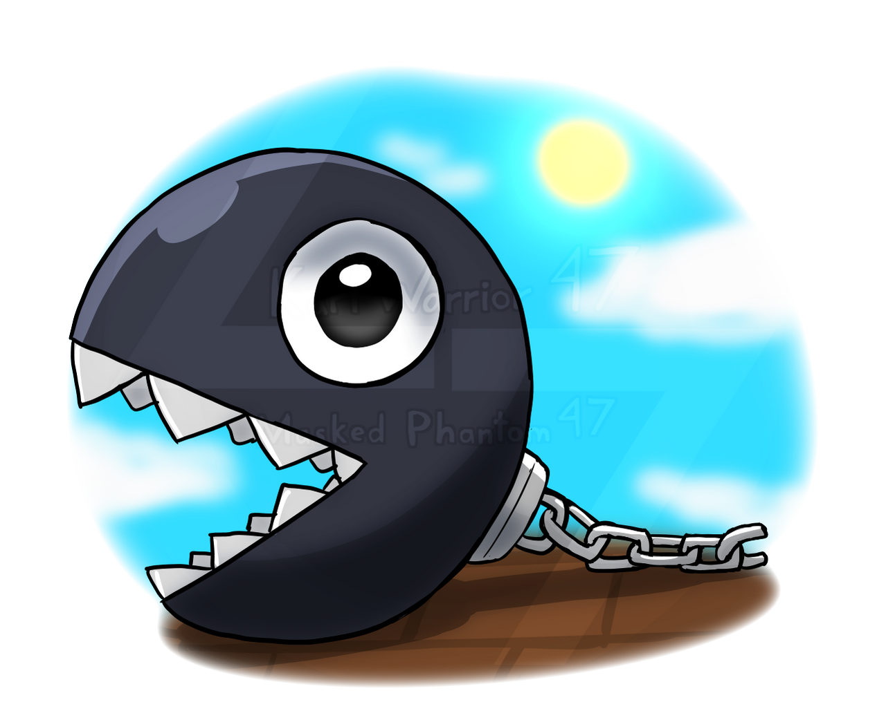

# Chain-chomp



Used under [CC License](https://creativecommons.org/licenses/by-nc-nd/3.0/) from [KarlWarrior47](https://www.deviantart.com/karlwarrior47/art/Just-a-chain-chomp-940153554).

Chain-chomp is an HTTP server for interacting with Spyre and USDC smart contracts. This application provides a simple HTTP interface for:

- Gasless USDC permits
- Gasless USDC deposits into Spyre game wallets
- On-chain match resolution via game wallets
- EIP712 validation
- Reading up to date nonce and withdraw information from game wallets
- Transaction resource objects for tracking blockchain operations

## Getting Started

Run locally using either `docker-compose`:

```
docker-compose up --build
```

or `pnpm`:

```
pnpm install
WEB3_CHAIN=base_sepolia pnpm run dev
```

or `docker`:

```
docker build -t chain-chomp .
docker run -p 10999:10999 -e WEB3_CHAIN=base_sepolia chain-chomp
```

## API

Full API documentation, with examples, can be found [here](https://documenter.getpostman.com/view/30699952/2sA3JDiksB).
